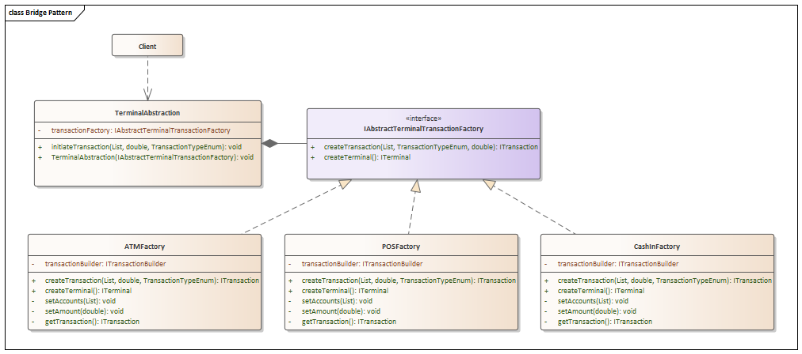
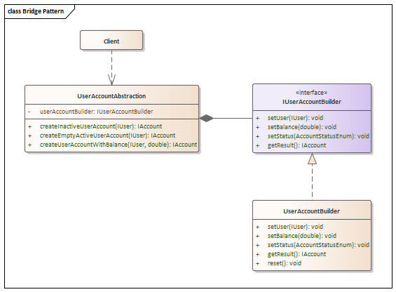
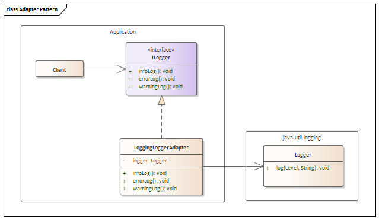

# Laboratory Work 2 - Structural Design Patterns


## Author: Gusev Roman

----

## Objectives:

* Study and understand the Structural Design Patterns.
* Choose a domain, define its main classes/models/entities and choose the appropriate instantiation 
mechanisms.
* Implement 3 Structural Design Patterns in the project.


## Theory:
In software engineering, the Structural Design Patterns are concerned with how classes and 
objects are composed to form larger structures. Structural class patterns use 
inheritance to create a hierarchy of classes/abstractions, but the structural object 
patterns use composition which is generally a more flexible alternative to inheritance.

Some examples of this kind of design patterns are:
* Adapter
* Bridge
* Composite
* Decorator
* Facade
* Flyweight
* Proxy

### Adapter
Adapter is a structural design pattern that allows objects with incompatible interfaces to collaborate. In other words,
it converts the interface of a class into another interface clients expect, in such way that no errors appear when they
are connected. Usually, it is done when some 3rd party libraries are deprecated or modified and methods used in the client
code is still dependent on the previous version of that library, thus Adapter can help with this. [[1]](#bib1)

<p align="center">
    
</p>

#### Participants
* **Client Interface** - describes a protocol that other classes must follow to be able to collaborate with the client code. Defines the domain-specific interface that Client uses.
* **Adapter** - is a class that’s able to work with both the client and the service: it implements the client interface, while wrapping the service object. 
The adapter receives calls from the client via the client interface and translates them into calls to the wrapped service object 
in a format it can understand. Adapts the interface of Service to the Client Interface.
* **Service** - is some useful class (usually 3rd-party or legacy). The client can’t use this class directly because it 
has an incompatible interface. Defines an existing interface that needs adapting.
* **Client** - is a class that contains the existing business logic of the program. Collaborates with objects conforming to 
the ClientInterface.


#### Applicability
* Use the Adapter pattern when you want to use an existing class, and its interface does not match the one you
  need.
* Use the Adapter pattern when you want to create a reusable class that cooperates with unrelated or unforeseen
  classes, that is, classes that don't necessarily have compatible interfaces.
* Use the Adapter pattern when (object adapter only) you need to use several existing subclasses, but it's impractical
  to adapt their interface by subclassing every one. An object adapter can adapt the
  interface of its parent class. [[2]](#bib2)

### Bridge
Bridge is a structural design pattern that lets you split a large class or a set of closely related classes into two 
separate hierarchies—abstraction and implementation—which can be developed independently of each other. In other words,
it decouples an abstraction from its implementation so that the two can vary independently. [[3]](#bib3)

<p align="center">
    
</p>

#### Participants
* **Abstraction** - provides high-level control logic. It relies on the implementation object to do the actual low-level work.
* **Implementation** - The Implementation declares the interface that’s common for all concrete implementations. An abstraction can only communicate with an implementation object via methods that are declared here. The abstraction may list the same methods as the implementation, but usually the abstraction declares some complex behaviors that rely on a wide variety of primitive operations declared by the implementation.
* **Concrete Implementations** - implements the Implementor interface and defines its concrete implementation.
* **Refined Abstractions** - provide variants of control logic. Like their parent, they work with different implementations via the general implementation interface.
* **Client** - Usually, is only interested in working with the abstraction.H owever, it’s the client’s job to link the abstraction object with one of the implementation objects.

#### Applicability
* Use the Bridge pattern you want to avoid a permanent binding between an abstraction and its
  implementation. This might be the case, for example, when the implementation
  must be selected or switched at run-time.
* Use the Bridge pattern when both the abstractions and their implementations should be extensible by
  subclassing. In this case, the Bridge pattern lets you combine the different
  abstractions and implementations and extend them independently
* Use the Bridge when changes in the implementation of an abstraction should have no impact on clients;
  that is, their code should not have to be recompiled.
* Use the Bridge pattern when you want to share an implementation among multiple objects (perhaps using
  reference counting), and this fact should be hidden from the client. [[4]](#bib4)

### Composite
Composite is a structural design pattern that lets you compose objects into tree structures and then work with these structures as if they were individual objects.
In other words, it composes objects into tree structures to represent part-whole hierarchies. Composite lets
clients treat individual objects and compositions of objects uniformly. [[5]](#bib5)

<p align="center">
    
</p>

#### Participants
* **Component** - describes operations that are common to both simple and complex elements of the tree.
* **Leaf** - is a basic element of a tree that doesn’t have sub-elements.
* **Container** - is an element that has sub-elements: leaves or other containers. A container doesn’t know the concrete classes of its children. It works with all sub-elements only via the component interface. Upon receiving a request, a container delegates the work to its sub-elements, processes intermediate results and then returns the final result to the client.
* **Client** - works with all elements through the component interface. As a result, the client can work in the same way with both simple or complex elements of the tree.

#### Applicability
* Use the Composite when you want to represent part-whole hierarchies of objects.
* Use the Composite when you want clients to be able to ignore the difference between compositions of objects
  and individual objects. Clients will treat all objects in the composite structure
  uniformly. [[6]](#bib6)

### Decorator
Decorator is a structural design pattern that lets you attach new behaviors to objects by placing these objects inside special wrapper objects that contain the behaviors. 
In other words, it allows to attach additional responsibilities to an object dynamically. Decorators provide a flexible
alternative to subclassing for extending functionality. [[7]](#bib7)

<p align="center">
    
</p>

#### Participants
* **Component** - declares the common interface for both wrappers and wrapped objects.
* **Concrete Component** - is a class of objects being wrapped. It defines the basic behavior, which can be altered by decorators.
* **Base Decorator** - has a field for referencing a wrapped object. The field’s type should be declared as the component interface so it can contain both concrete components and decorators. The base decorator delegates all operations to the wrapped object.
* **Concrete Decorators** - define extra behaviors that can be added to components dynamically. Concrete decorators override methods of the base decorator and execute their behavior either before or after calling the parent method.
* **Client** - can wrap components in multiple layers of decorators, as long as it works with all objects via the component interface.


#### Applicability
* Use the Decorator pattern to add responsibilities to individual objects dynamically and transparently, that is,
  without affecting other objects.
* Use the Decorator pattern for responsibilities that can be withdrawn.
* Use the Decorator pattern when extension by subclassing is impractical. Sometimes a large number of
  independent extensions are possible and would produce an explosion of subclasses
  to support every combination. Or a class definition may be hidden or otherwise
  unavailable for subclassing. [[8]](#bib8)

### Facade
Facade is a structural design pattern that provides a simplified interface to a library, a framework, or any other complex set of classes.
In other words, it provides a unified interface to a set of interfaces in a subsystem. Facade defines a higherlevel interface that makes the subsystem easier to use. [[9]](#bib9)

<p align="center">
    
</p>

#### Participants
* **Facade** - provides convenient access to a particular part of the subsystem’s functionality. It knows where to direct the client’s request and how to operate all the moving parts.
* **Additional Facade** - can be created to prevent polluting a single facade with unrelated features that might make it yet another complex structure. Additional facades can be used by both clients and other facades.
* **Complex Subsystem** - consists of dozens of various objects. To make them all do something meaningful, you have to dive deep into the subsystem’s implementation details, such as initializing objects in the correct order and supplying them with data in the proper format. Subsystem classes aren’t aware of the facade’s existence. They operate within the system and work with each other directly.
* **Client** - uses the facade instead of calling the subsystem objects directly.


#### Applicability
* Use the Facade pattern when you want to provide a simple interface to a complex subsystem. Subsystems often
  get more complex as they evolve. Most patterns, when applied, result in more and
  smaller classes. This makes the subsystem more reusable and easier to customize,
  but it also becomes harder to use for clients that don't need to customize it. A
  facade can provide a simple default view of the subsystem that is good enough for
  most clients. Only clients needing more customizability will need to look beyond the
  facade.
* Use the Facade pattern when there are many dependencies between clients and the implementation classes of an
  abstraction. Introduce a facade to decouple the subsystem from clients and other
  subsystems, thereby promoting subsystem independence and portability.
* Use the Facade pattern when you want to layer your subsystems. Use a facade to define an entry point to each
  subsystem level. If subsystems are dependent, then you can simplify the
  dependencies between them by making them communicate with each other solely
  through their facades. [[10]](#bib10)

### Flyweight
Flyweight is a structural design pattern that lets you fit more objects into the available amount of RAM by sharing common parts of state between multiple objects instead of keeping all of the data in each object.
In other words, it uses sharing to support large numbers of fine-grained objects efficiently [[11]](#bib11)

<p align="center">
    
</p>

#### Participants
* **Flyweight Factory** - manages a pool of existing flyweights. With the factory, clients don’t create flyweights directly. Instead, they call the factory, passing it bits of the intrinsic state of the desired flyweight. The factory looks over previously created flyweights and either returns an existing one that matches search criteria or creates a new one if nothing is found.
* **Flyweight** - contains the portion of the original object’s state that can be shared between multiple objects. The same flyweight object can be used in many different contexts. The state stored inside a flyweight is called intrinsic. The state passed to the flyweight’s methods is called extrinsic.
* **Context** - contains the extrinsic state, unique across all original objects. When a context is paired with one of the flyweight objects, it represents the full state of the original object.
* **Client** - uses the facade instead of calling the subsystem objects directly.

#### Applicability
The Flyweight pattern's effectiveness depends heavily on how and where it's used. Apply the
Flyweight pattern when all the following are true:
* An application uses a large number of objects.
* Storage costs are high because of the sheer quantity of objects.
* Most object state can be made extrinsic.
* Many groups of objects may be replaced by relatively few shared objects once
  extrinsic state is removed.
* The application doesn't depend on object identity. Since flyweight objects may be
  shared, identity tests will return true for conceptually distinct objects. [[12]](#bib12)

### Proxy
Proxy is a structural design pattern that lets you provide a substitute or placeholder for another object. A proxy controls access to the original object, allowing you to perform something either before or after the request gets through to the original object.
In other words, it provides a surrogate or placeholder for another object to control access to it. [[13]](#bib13)

<p align="center">
    
</p>

#### Participants
* **Service Interface** - declares the interface of the Service. The proxy must follow this interface to be able to disguise itself as a service object.
* **Service** - is a class that provides some useful business logic.
* **Proxy** - has a reference field that points to a service object. After the proxy finishes its processing (e.g., lazy initialization, logging, access control, caching, etc.), it passes the request to the service object. Usually, proxies manage the full lifecycle of their service objects.
* **Client** - should work with both services and proxies via the same interface. This way you can pass a proxy into any code that expects a service object.

#### Applicability
* Lazy initialization (virtual proxy). This is when you have a heavyweight service object that wastes system resources by being always up, even though you only need it from time to time.
* Access control (protection proxy). This is when you want only specific clients to be able to use the service object; for instance, when your objects are crucial parts of an operating system and clients are various launched applications (including malicious ones).
* Local execution of a remote service (remote proxy). This is when the service object is located on a remote server.
* Logging requests (logging proxy). This is when you want to keep a history of requests to the service object.
* Caching request results (caching proxy). This is when you need to cache results of client requests and manage the life cycle of this cache, especially if results are quite large. 
* Smart reference. This is when you need to be able to dismiss a heavyweight object once there are no clients that use it. [[14]](#bib14)

[//]: # (## Used Design Patterns:)

[//]: # ()
[//]: # (* DP0)

[//]: # (* PD1)

[//]: # (* ...)


## Implementation

* For this Laboratory Work, I had to implement 3 Structural Design Patterns. 
I have chosen to implement Bridge, Adapter and Proxy Structural Design Patterns.

* I decided to build upon the topic of Terminal Interaction and Transaction / Financial Operations on Accounts and between them as 
well. I have used previous Laboratory Works that performs operations, such as: 
    * Creating User Entities,
    * Creating User Account Entities,
    * Creating Transaction Entities,
    * Creating Terminal Entities,
    * Depositing money into a User Account,
    * Withdrawing money from a User Account,
    * Transferring money between User Accounts,
    * Logs the financial operations and processes in the application (errors, successful operations, etc.),
    * Validator for Transaction operations.
    * Implements Abstract Factory for Terminal and Transaction creation.
    * Implements Builder for User Account and Transaction creation.
    * Implements Singleton for Logger, Transaction Validator and Account Status Validator.

#### Bridge Pattern
* Bridge Structural Design Pattern - lets separate the abstraction (high-level/business logic) from the implementation (low-level/platform-specific logic),
so that they can evolve separately, without affecting each other. This is useful when business logic is strongly dependent on the medium
that actually dictates how it should be done, thus enabling the implementation to be extended in such way that will not affect the abstraction.

* First, I started by modelling the UML Diagram for that purpose. I followed the classical structure of the Bridge Pattern.
In my case, the Abstract, or High-Level Logic, part is represented by TerminalAbstraction, that has a reference to the 
Implementation part, that can be substituted by various concrete implementations of Abstract Factory for Terminal/Transaction
creation.

<p align="center">
    
</p>

* As in the diagram above, I adjusted the classes for concrete Abstract Factory implementation, by adding several low-level
logic inside of it, that will help achieve high-level logic from abstraction, since it relies on the implementation object and its methods,
that will fulfill client's needs.
  * [ATMFactory](Utils/Factories/ATMFactory.java) - is responsible for creation of Transactions by Transaction Type (all of them),
and creation of ATM Terminal. The building process was separated into several steps, to ensure the low-level logic behind the abstraction,
that is done "under the hood" of the implementation.
```java
public class ATMFactory implements IAbstractTerminalTransactionFactory {
    private ITransactionBuilder transactionBuilder;
    ...
    @Override
    public ITransaction createTransaction(List<IAccount> accounts, double amount, TransactionTypeEnum transactionType) {
        ...
        try {
            setAccounts(accounts);
            setAmount(amount);
            return getTransaction();
        } catch (IllegalArgumentException e) {
            this.logger.errorLog("Failed ATM Transaction: " + e.getMessage());
            return null;
        }
    }
    ...
    private void setAccounts(List<IAccount> accounts) {
        this.transactionBuilder.setAccounts(accounts);
    }
    private void setAmount(Double amount) {
        this.transactionBuilder.setAmount(amount);
    }
    private ITransaction getTransaction() {
        return this.transactionBuilder.getResult();
    }
}
```
  * [POSFactory](Utils/Factories/POSFactory.java) - is responsible for creation of Transactions by Transaction Type (only Withdrawal),
and creation of POS Terminal. The building process was separated into several steps for the same reason as in previous case.
The only difference is that POS Terminal can perform only Withdrawal Transactions, thus the implementation is only for that type.
The same structure is applied for [CashInFactory](Utils/Factories/CashInFactory.java).
```java
public class POSFactory implements IAbstractTerminalTransactionFactory {
    ITransactionBuilder transactionBuilder;
    ...
    @Override
    public ITerminal createTerminal() {
        return new POSTerminal();
    }
    
    private void setAccounts(List<IAccount> accounts) {
        this.transactionBuilder.setAccounts(accounts);
    }
    
    private void setAmount(Double amount) {
        this.transactionBuilder.setAmount(amount);
    }
    
    private ITransaction getTransaction() {
        return this.transactionBuilder.getResult();
    }
}
```
  * [TerminalAbstraction](ClientAbstraction/TerminalAbstraction.java) - is the Abstraction class that is responsible for
providing methods for High-Level Business Logic, in this case - creation and performing of Transactions by the use of
Transaction Factories, as they provide the Low-Level logic for the Abstraction. The Abstraction class has a reference to the
Implementation class, as in the general UML Diagram.
```java
public class TerminalAbstraction {
    private IAbstractTerminalTransactionFactory transactionFactory;
  
    public TerminalAbstraction(IAbstractTerminalTransactionFactory transactionFactory) {
        this.transactionFactory = transactionFactory;
    }
  
    public void initiateTransaction(List<IAccount> accounts, double amount, TransactionTypeEnum transactionType) {
        ITransaction transaction = transactionFactory.createTransaction(accounts, amount, transactionType);
        ITerminal terminal = transactionFactory.createTerminal();
        terminal.performTransaction(transaction);
    }
}
```

The collaboration between those classes provides the possibility to use the Abstraction class to perform the Transaction, where
client knows only about the details of Transaction, but not about the Terminal or Transaction creation process:
```java
// NEW WAY
TerminalAbstraction ATMTerminalClient = new TerminalAbstraction(new ATMFactory());

ATMTerminalClient.initiateTransaction(List.of(userAccount1), 100.0, TransactionTypeEnum.WITHDRAWAL);
```
Compared to the previous version of the implementation, where the client had to know the exact implementation of the ITerminal
concrete implementations and, at the same time, the logic of Factory classes for Transaction/Terminal creation:
```java
// OLD WAY
IAbstractTerminalTransactionFactory ATMFactory = new ATMFactory();
ITerminal atmTerminal = ATMFactory.createTerminal();

ITransaction depositTransaction = ATMFactory.createTransaction(List.of(userAccount1), 100.0, TransactionTypeEnum.WITHDRAWAL);
atmTerminal.performTransaction(depositTransaction);
```

* At the same time, I implemented the Bridge Pattern for handling User Account creation. Exactly, I designed a new class
that has a reference to IUserAccountBuilder interface, that is implemented by UserAccountBuilder class, and will provide several
methods to create different types of accounts - Inactive, Active with Empty Balance and Active with Initial Balance:
<p align="center">
    
</p>

* [UserAccountAbstraction](ClientAbstraction/UserAccountAbstraction.java) - is the Abstraction class that references the
Builder Implementation class and provides methods for creating different types of User Accounts, as mentioned above. This class,
inside its methods, builds different types of UserAccounts by calling methods from low-level class. This ensures that client
only specifies the information about IUser object, but not about the details of the User Account creation process, this being
handled by the Builder Implementation.

```java
public class UserAccountAbstraction {
    private IUserAccountBuilder userAccountBuilder;

    public UserAccountAbstraction(IUserAccountBuilder userAccountBuilder) {
        this.userAccountBuilder = userAccountBuilder;
    }

    public IAccount createInactiveUserAccount(IUser user) {
        userAccountBuilder.setUser(user);
        return userAccountBuilder.getResult();
    }

    public IAccount createEmptyActiveUserAccount(IUser user) {
        userAccountBuilder.setUser(user);
        userAccountBuilder.setStatus(AccountStatusEnum.ACTIVE);
        userAccountBuilder.setBalance(0.0);
        return userAccountBuilder.getResult();
    }

    public IAccount createUserAccountWithBalance(IUser user, double balance) {
        userAccountBuilder.setUser(user);
        userAccountBuilder.setStatus(AccountStatusEnum.ACTIVE);
        userAccountBuilder.setBalance(balance);
        return userAccountBuilder.getResult();
    }
}
```

As in the previous case, the client code is simplified and the logic between abstraction and implementor is decoupled, 
thus providing a way to create different types in the following manner. Suppose I have 2 users:
```java
User user1 = new User("John Doe");
User user2 = new User("Jane Doe");
```
I need to instantiate a builder object:
```java
IUserAccountBuilder userAccountBuilder = new UserAccountBuilder();
```
Then, I can create different types of User Accounts by using the Abstraction class:
```java
// NEW WAY
UserAccountAbstraction userAccountAbstraction = new UserAccountAbstraction(userAccountBuilder);
IAccount userAccount1 = userAccountAbstraction.createEmptyActiveUserAccount(user1);

IAccount userAccount2 = userAccountAbstraction.createUserAccountWithBalance(user2, 50.0);
User user3 = new User("John Smith");
```
Compared to the previous version of the implementation, where besides the preparation of the User Account Builder, the client
had to build the User Account by passing through each step of the User Account creation process, becoming strongly coupled to
the low-level logic of the User Account Builder:
```java
// OLD WAY
userAccountBuilder.setUser(user1);
userAccountBuilder.setBalance(0.0);
userAccountBuilder.setStatus(AccountStatusEnum.ACTIVE);
IAccount userAccount1 =  userAccountBuilder.getResult();

// OLD WAY
userAccountBuilder.setUser(user2);
userAccountBuilder.setBalance(50.0);
userAccountBuilder.setStatus(AccountStatusEnum.ACTIVE);
IAccount userAccount2 =  userAccountBuilder.getResult();
```

Thus, the Bridge Pattern is implemented in the application, thus providing a way to give Clients as much abstraction as possible,
leaving behind the scenes the low-level implementation that is responsible to ensuring that client will get the desired
result, without making him know the details of the implementation, thus decoupling the logic between them, making code more
scalable, flexible and easier to maintain in case of new implementations.

#### Adapter Pattern

  * Adapter Structural Design Pattern - helps to make two incompatible interfaces compatible, by converting the methods
of a Target class so that they can operate with methods of an Adaptee class via an Adapter class. This is useful when
some libraries are modified/deprecated, but the client still wants to use those methods. This ensures that the only modification
will be done in the Adapter class, while the rest of the code will remain the same, reducing the amount of code modification.

  * For this task, I started with modelling the UML Diagram. I followed the classical structure of the Adapter Pattern, 
making the Adaptee - 2 types of Loggers, and the Target - ILogger interface.

<p align="center">
    
</p>

  * As in the diagram from above, I adjusted the already existing implementation of LoggerAdapter, that was responsible
for binding together Logger from Java Util Logging library and ILogger interface that is used across the application. I
used a joining class - LoggerUtil responsible for the specification of a certain ILogger concrete implementor, to be easier
to switch between them, without modifying the client code.

  * [ILogger](Interfaces/ILogger.java) - is an interface that contains the methods for logging information, errors, 
and warnings. It remained unmodified from the previous Laboratory Work.
```java
public interface ILogger {
    void infoLog(String message);
    void errorLog(String message);
    void warningLog(String message);
}
```

  * [LoggerUtil](Utils/Logging/LoggerUtil.java) - is a class that contains a single method that will return the required
ILogger Implementation. In this case, everywhere in the client code, the instance of ILogger will be replaced with
LoggingLoggerAdapter.
```java
public class LoggerUtil {
  public static ILogger getInstance() {
    return LoggingLoggerAdapter.getInstance();
  }
}
```

  * [LoggingLoggerAdapter](Utils/Adapters/LoggingLoggerAdapter.java) - is a class that implements the ILogger interface
connecting this with the Logger from Java Util Logging library. It contains several methods for message logging used across the 
application, and separate configuration of the format of the log messages, that stayed the same from the previous laboratory work.
```java
public class LoggingLoggerAdapter implements ILogger {
    private static LoggingLoggerAdapter instance;
    private final Logger logger;

    private LoggingLoggerAdapter() {
        this.logger = Logger.getLogger(LoggingLoggerAdapter.class.getName());
        this.logger.setLevel(Level.ALL);

        ConsoleHandler consoleHandler = new ConsoleHandler();
        consoleHandler.setFormatter(new LogFormatter());
        consoleHandler.setLevel(Level.ALL);

        try {
            FileHandler fileHandler = new FileHandler("src/main/java/Laboratory_Work_3_Structural_Patterns/Utils/Logging/Logs/logs.log", true);
            fileHandler.setFormatter(new LogFormatter());
            fileHandler.setLevel(Level.ALL);
            this.logger.addHandler(fileHandler);
        } catch (IOException e) {
            System.out.println("Failed to Initialize File Handler for Logging: " + e.getMessage());
            this.errorLog("Failed to Initialize File Handler for Logging: " + e.getMessage());
        }

        this.logger.addHandler(consoleHandler);
        this.logger.setUseParentHandlers(false);
    }
    ...
    @Override
    public void infoLog(String message) {
        logger.log(Level.INFO, getCallingClassAndMethod() + " :: " + message);
    }

    @Override
    public void warningLog(String message) {
        logger.log(Level.WARNING, getCallingClassAndMethod() + " :: " + message);
    }

    @Override
    public void errorLog(String message) {
        logger.log(Level.SEVERE, getCallingClassAndMethod() + " :: " + message);
    }
}
```

  * At the same time, I implemented another Adapter for the Log4j Logger from apache library, in order to simulate
the situation when the Client wants to use another Logger implementation, but the ILogger interface is already implemented,
thus the Adapter will help to make the Log4j Logger compatible with ILogger interface.
  * Similarly, I modelled the UML Diagram for the new Adapter implementation:

<p align="center">
    
</p>

  * [Log4jLoggerAdapter](Utils/Adapters/Log4jAdapter.java) - is a class that implements the ILogger interface and binds the
logic of this interface with the Logger from Apache library. It contains methods for message logging and for the configuration
of the format of the log messages.
```java
public class Log4jAdapter implements ILogger {
    private final Logger logger;
    private static Log4jAdapter instance;

    private Log4jAdapter() {
        this.logger = LogManager.getLogger(Log4jAdapter.class);
    }
    ...
    @Override
    public void infoLog(String message) {
        logger.log(Level.INFO, getCallingClassAndMethod() + " :: " + message);
    }

    @Override
    public void warningLog(String message) {
        logger.log(Level.WARN, getCallingClassAndMethod() + " :: " + message);
    }

    @Override
    public void errorLog(String message) {
        logger.log(Level.ERROR, getCallingClassAndMethod() + " :: " + message);
    }
}
```
  * The configuration of the Logger is presented in a XML file places in resources, ensuring that it will be automatically
read at the instantiation of the Logger object.
```xml
<?xml version="1.0" encoding="UTF-8"?>
<Configuration status="WARN">
    <Appenders>
        <Console name="Console" target="SYSTEM_OUT">
            <PatternLayout pattern="%d{EEE MMM dd HH:mm:ss Z yyyy} :: [%level] :: %M :: %msg%n"/>
        </Console>
        <File name="File" fileName="src/main/java/Laboratory_Work_3_Structural_Patterns/Utils/Logging/Logs/logs.log" append="true">
            <PatternLayout pattern="%d{EEE MMM dd HH:mm:ss Z yyyy} :: [%level] :: %M :: %msg%n"/>
        </File>
    </Appenders>

    <Loggers>
        <Root level="info">
            <AppenderRef ref="Console"/>
            <AppenderRef ref="File"/>
        </Root>
    </Loggers>
</Configuration>
```

This approach allows us to use 2 types of logger across the application in the following manner:
```java
ILogger logger = LoggerUtil.getInstance();
```
As it may be noticed, the actual ILogger concrete implementation will depend on the spcefication in the
LoggerUtil class, thus providing a way to switch between different Logger implementations without modifying the client code.
At the same time, it will ensure that the Interfaces between the client Target class and Adaptee class, will be
compatible and will work correctly, without breaking the existing client code.
  * Here is presented the output of the Log files for both ILogger implementations:
    * Java Util Logging:
    ```text
    Mon Nov 11 03:17:28 EET 2024 :: [INFO] :: infoLog :: Laboratory_Work_3_Structural_Patterns.Utils.Validators.AccountStatusValidator::validateAccountStatus :: Account 1 is ACTIVE
    Mon Nov 11 03:17:28 EET 2024 :: [INFO] :: infoLog :: Laboratory_Work_3_Structural_Patterns.User.UserAccount::getAccountId :: Requested account ID for account 1
    Mon Nov 11 03:17:28 EET 2024 :: [INFO] :: infoLog :: Laboratory_Work_3_Structural_Patterns.User.UserAccount::getBalance :: Checking balance for account 1
    Mon Nov 11 03:17:28 EET 2024 :: [WARNING] :: warningLog :: Laboratory_Work_3_Structural_Patterns.Utils.Validators.TransactionValidator::validateSufficientFunds :: Insufficient funds in account 1. Available: 0.0, required: 100.0
    Mon Nov 11 03:17:28 EET 2024 :: [SEVERE] :: errorLog :: Laboratory_Work_3_Structural_Patterns.Transactions.WithdrawalTransaction::executeTransaction :: Withdrawal Transaction failed for Account 1
    ```
    * Apache Log4j Logging:
    ```text
    Mon Nov 11 00:24:08 +0200 2024 :: [INFO] :: infoLog :: Laboratory_Work_3_Structural_Patterns.Utils.Validators.AccountStatusValidator::validateAccountStatus :: Account 1 is ACTIVE
    Mon Nov 11 00:24:08 +0200 2024 :: [INFO] :: infoLog :: Laboratory_Work_3_Structural_Patterns.User.UserAccount::getAccountId :: Requested account ID for account 1
    Mon Nov 11 00:24:08 +0200 2024 :: [INFO] :: infoLog :: Laboratory_Work_3_Structural_Patterns.User.UserAccount::getBalance :: Checking balance for account 1
    Mon Nov 11 00:24:08 +0200 2024 :: [WARN] :: warningLog :: Laboratory_Work_3_Structural_Patterns.Utils.Validators.TransactionValidator::validateSufficientFunds :: Insufficient funds in account 1. Available: 0.0, required: 100.0
    Mon Nov 11 00:24:08 +0200 2024 :: [ERROR] :: errorLog :: Laboratory_Work_3_Structural_Patterns.Transactions.WithdrawalTransaction::executeTransaction :: Withdrawal Transaction failed for Account 1
    ```
Both log messages display the same information about the operations in the application, the only difference being the 
format of the log messages levels and the format for the time. Thus, by enabling the client access only the interface ILogger,
the Adapter will handle the binding the methods between them so that they can work together, without affecting the client code.

#### Abstract Factory Pattern

  * Abstract Factory Creational Design Pattern - lets us produce families of related objects without specifying their 
concrete classes. The Abstract Factory pattern helps us control the classes of objects that an application creates. 
Because a factory encapsulates the responsibility and the process of creating product objects, it isolates clients from
implementation classes. It promotes consistency among products. When product objects in a family are designed to work 
together, it's important that an application use objects from only one family at a time. AbstractFactory makes this easy 
to enforce.

  * For this pattern, I decided to implement Abstract Factory that will group families of ITerminal and ITransaction
implementations, since they are related to cooperative tasks (POSTerminal can perform only WithdrawalTransaction, 
CashInTerminal - only DepositTransaction and ATMTerminal - all 3 types of Transactions).

  * [IAbstractTerminalTransactionFactory](Interfaces/IAbstractTerminalTransactionFactory.java) - is an interface that
specifies methods should be present in concrete implementations of the Abstract Factory. In our case, the methods are
createTransaction(...) and createTerminal(). 
```java
public interface IAbstractTerminalTransactionFactory {
    ITransaction createTransaction(List<IAccount> accounts, double amount, TransactionTypeEnum transactionType);
    ITerminal createTerminal();
}
```

  * [POSFactory](Utils/Factories/POSFactory.java) - is a class that implements the IAbstractTerminalTransactionFactory
interface and is responsible for creating the POSTerminal and WithdrawalTransaction objects. In this class, the methods
are implemented to create the objects and return them. The Transaction is of type Withdrawal, since POSTerminal can only
perform Withdrawal operations, and, at the same time, the POSTerminal is created and returned.
```java
public class POSFactory implements IAbstractTerminalTransactionFactory {
    @Override
    public ITransaction createTransaction(List<IAccount> accounts, double amount, TransactionTypeEnum transactionType) {
        if (transactionType != TransactionTypeEnum.WITHDRAWAL) {
            return null;
        }
        ITransactionBuilder withdrawalTransactionBuilder = new WithdrawalTransactionBuilder();
        withdrawalTransactionBuilder.setAccounts(accounts);
        withdrawalTransactionBuilder.setAmount(amount);
        return withdrawalTransactionBuilder.getResult();
    }

    @Override
    public ITerminal createTerminal() {
        return new POSTerminal();
    }
}
```
This approach allows us to use the POSFactory across the application in the following manner:

```java
IAbstractTerminalTransactionFactory factory = new POSFactory();
ITerminal atmTerminal = factory.createTerminal();
ITransaction atmTransaction = factory.createTransaction(accounts, amount, transactionType);
```
As it may be noticed, the implementation requires only the concrete type of Factory to be specified. The Factory will 
handle the creation of products by itself, thus providing a possibility to create a family of related objects without
specifying their concrete classes.

  * [ATMFactory](Utils/Factories/ATMFactory.java) - is a class that implements the IAbstractTerminalTransactionFactory
interface and is responsible for creating the ATMTerminal and all 3 types of Transactions objects, since this type of 
terminal may perform multiple types of transactions. In this class, the methods are implemented to create different
Transactions and the ATMTerminal and return them.
```java
public class ATMFactory implements IAbstractTerminalTransactionFactory {
    @Override
    public ITransaction createTransaction(List<IAccount> accounts, double amount, TransactionTypeEnum transactionType) {
        switch (transactionType) {
            case DEPOSIT:
                try {
                    ITransactionBuilder depositTransactionBuilder = new DepositTransactionBuilder();
                    depositTransactionBuilder.setAccounts(accounts);
                    depositTransactionBuilder.setAmount(amount);
                    return depositTransactionBuilder.getResult();
                }
                catch(IllegalArgumentException e) {
                    return null;
                }
            case WITHDRAWAL:
                try {
                    ITransactionBuilder withdrawalTransactionBuilder = new WithdrawalTransactionBuilder();
                    withdrawalTransactionBuilder.setAccounts(accounts);
                    withdrawalTransactionBuilder.setAmount(amount);
                    return withdrawalTransactionBuilder.getResult();
                }
                catch(IllegalArgumentException e) {
                    return null;
                }
            case EXCHANGE:
                try {
                    ITransactionBuilder exchangeTransactionBuilder = new ExchangeTransactionBuilder();
                    exchangeTransactionBuilder.setAccounts(accounts);
                    exchangeTransactionBuilder.setAmount(amount);
                    return exchangeTransactionBuilder.getResult();
                }
                catch(IllegalArgumentException e) {
                    return null;
                }
            default:
                return null;
        }
    }

    @Override
    public ITerminal createTerminal() {
        return new ATMTerminal();
    }
}
```
This approach permit us to use the ATMFactory across the application in the following manner:
```java
IAbstractTerminalTransactionFactory ATMFactory = new ATMFactory();
ITerminal atmTerminal = ATMFactory.createTerminal();
ITransaction depositTransaction = ATMFactory.createTransaction(List.of(userAccount1), 100.0, TransactionTypeEnum.WITHDRAWAL);
ITransaction withdrawalTransaction = ATMFactory.createTransaction(List.of(userAccount1), 100.0, TransactionTypeEnum.DEPOSIT);
ITransaction exchangeTransaction = ATMFactory.createTransaction(List.of(userAccount1, userAccount2), 100.0, TransactionTypeEnum.EXCHANGE);
```
As it may be noticed, the transactions are created via the same method, but with different parameters. This allows us to
create different types of transactions without specifying their concrete classes, thus providing a possibility to create
a family of related objects without specifying their concrete classes.

  * [CashInFactory](Utils/Factories/CashInFactory.java) - is a class that implements the IAbstractTerminalTransactionFactory
interface and is responsible for creating the CashInTerminal and DepositTransaction objects. In this class, the methods
are implemented to create the objects and return them.

```java
public class CashInFactory implements IAbstractTerminalTransactionFactory {
    @Override
    public ITransaction createTransaction(List<IAccount> accounts, double amount, TransactionTypeEnum transactionType) {
        if (transactionType != TransactionTypeEnum.DEPOSIT) {
            return null;
        }
        ITransactionBuilder depositTransactionBuilder = new DepositTransactionBuilder();
        depositTransactionBuilder.setAccounts(accounts);
        depositTransactionBuilder.setAmount(amount);
        return depositTransactionBuilder.getResult();
    }

    @Override
    public ITerminal createTerminal() {
        return new CashInTerminal();
    }
}
```
As in previous examples, this approach allows us to use the CashInFactory across the application in the following manner:
```java
IAbstractTerminalTransactionFactory CashInFactory = new CashInFactory();
ITerminal cashInTerminal = CashInFactory.createTerminal();
ITransaction depositTransaction2 = CashInFactory.createTransaction(List.of(userAccount1), 100.0, TransactionTypeEnum.DEPOSIT);
``` 


## Conclusions / Screenshots / Results
In conclusion, I want to emphasize that through the implementation of the Creational Design Patterns, I have managed to
understand better how the mechanisms behind those patterns work, how they make code easier to maintain and extend, and how
to use them in practice. The Builder Pattern allowed me to create complex objects step by step, the Singleton Pattern
to use single instance of an object across the project and reuse it easily and the Abstract Factory Pattern taught me how
to group families of related objects and create them as a batch without specifying their concrete classes. At the end,
those patterns, alongside with other Creational Design Patterns make the creation of objects easier, more flexible and
more maintainable, thus improving the overall quality of the code.


## References
<a id="bib1"></a>[1] Refactoring Guru, “Adapter” Refactoring.guru, 2014. https://refactoring.guru/design-patterns/adapter

<a id="bib2"></a>[2] “Creational Patterns.” pg.140 Available: https://www.javier8a.com/itc/bd1/articulo.pdf

<a id="bib3"></a>[3] Refactoring Guru, “Bridge” Refactoring.guru, 2014. https://refactoring.guru/design-patterns/bridge

<a id="bib4"></a>[4] “Creational Patterns.” pg.153 Available: https://www.javier8a.com/itc/bd1/articulo.pdf

<a id="bib5"></a>[5] Refactoring Guru, “Composite” Refactoring.guru, 2014. https://refactoring.guru/design-patterns/composite

<a id="bib6"></a>[6] “Creational Patterns.” pg.164 Available: https://www.javier8a.com/itc/bd1/articulo.pdf

<a id="bib7"></a>[7] Refactoring Guru, “Decorator,” Refactoring.guru, 2014. https://refactoring.guru/design-patterns/decorator

<a id="bib8"></a>[8] “Creational Patterns.” pg.177 Available: https://www.javier8a.com/itc/bd1/articulo.pdf

<a id="bib9"></a>[9] Refactoring Guru, “Facade” Refactoring.guru, 2014. https://refactoring.guru/design-patterns/facade

<a id="bib10"></a>[10] “Creational Patterns.” pg.186 Available: https://www.javier8a.com/itc/bd1/articulo.pdf

<a id="bib11"></a>[11] Refactoring Guru, “Flyweight” Refactoring.guru, 2014. https://refactoring.guru/design-patterns/flyweight

<a id="bib12"></a>[12] “Creational Patterns.” pg.197 Available: https://www.javier8a.com/itc/bd1/articulo.pdf

<a id="bib13"></a>[13] Refactoring Guru, “Proxy” Refactoring.guru, 2014. https://refactoring.guru/design-patterns/proxy

<a id="bib14"></a>[14] “Creational Patterns.” pg.208-209 Available: https://www.javier8a.com/itc/bd1/articulo.pdf
